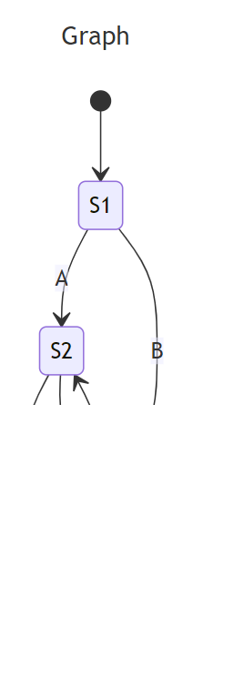
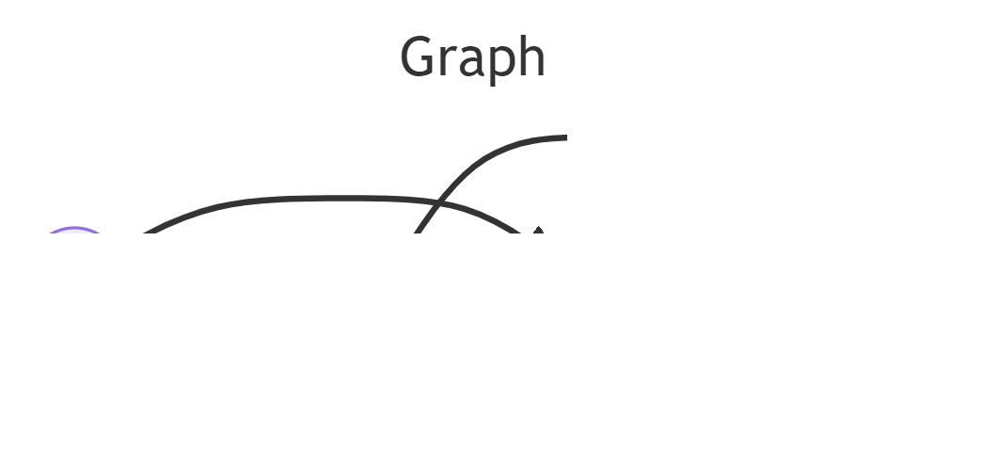

# Report

I spent the first week familiarizing a bit with the DFA's and various graph drawing libraries/tools. I started by reading through Algorithmics 1 slides for DFA's and doing exercises sheet. I then skimmed through the process of converting regular expression to a DFA in [this article](https://www.geeksforgeeks.org/regular-expression-to-dfa/). Afterwards I experimented with various tools for drawing graphs: Cytoscape JS, Mermaid JS, React Flow and SigmaJS. I have discarded SigmaJS and React Flow due to struggles of self-looping which was important for DFA's (e.g. an expression _a\*_ would need a state that would just loop to itself for as many times as we encounter character a). I preferred MermaidJS to Cytoscape JS because it seemed that Mermaid had a better built in way of placing states in a logical order whereas with Cytoscapee JS it was not trivial to make sure states appear in a neat structure. The downside of Mermaid JS is that it is essentially a language interpreter and I would need to express a graph in a language it understands, e.g.:
```
---
title: Graph
---
stateDiagram-v2
    [*] --> S1

    S1 --> S2: A
    S1 --> S3: B
    S2 --> S4: A
    S3 --> S4: B
    S2 --> S3: B
    S3 --> S2: A
    S4 --> S4: A, B
    S4::: finalState
    classDef finalState fill:#009,color:white,font-weight:bold
```
to give this graph:


Or using flowchart which seems to be even more flexible, but might have an inferiour placement of states:
```
---
title: Graph
---
flowchart LR
    S1((S1))
    S2((S2))
    S3((S3))
    S4(((S4)))
    S1 -->|a|S2
    S1 --> S3
    S2 --> S3
    S3 --> S2
    S2 --> S4
    S3 --> S4
    S4 -->|a,b|S4
```


But I think it is  quite simple to build a code generator for and I liked the flexibility it has over Cytoscape JS - better styling and state placement in my opinion. Cytosape allowed for some nice vertex placement, however that would typically come with randomized locations of vertices which I did not like. 

Finally, I started thinking on how to parse regex to a syntax tree as the first step of converting regex to DFA. I did not look up algorithms, wanted to make it a bit of an exercise. I have not had much chance to work on it yet, but the first step I thought of was to make implicit concatenation explicit by assignig it a "dot" character. E.g. _(a|b)\*abb#_ -> _(a|b)\*.a.b.b.#_ 
It seemed to me that it might help to do this as we have explicit concatenation in the syntax tree:


Although I might be wrong - I won't spend too much time experimenting if I cannot think of a solution myself and will move on to something that parses regex to syntax tree.

## Questions
1. How should the animation work? This algorithm is quite involved. Should the animation be: finalized states appear one by one, then edges appear one by one + some commentary? Or should the DFA appear at once and animation would be of accepting/rejecting an expression by going through the DFA? I.E. are we animating building of the DFA or processing expressions, or both?
